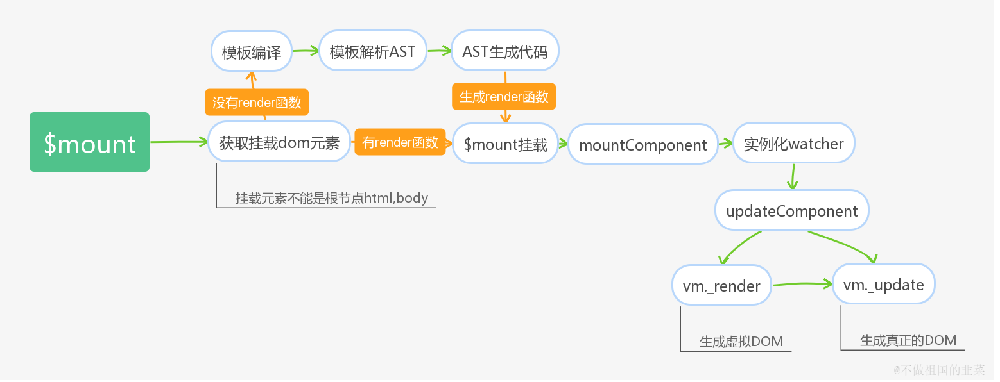

# Vue 源码入门和调试指南

## Runtime Only VS Runtime + Compiler

当执行 `import Vue from 'vue'` 的时候，从源码入口开始初始化。 `vue` 基于源码构建有两个版本，一个是 `runtime only` (只包含运行时的版本)，另一个是 `runtime + compiler` (同时包含编译器和运行时的版本)。两个版本的区别仅在于后者包含了一个编译器，内置的编译器实现了将 `template` 模板转换编译为可执行 `javascript` 脚本的功能。

### Runtime + Compiler

一个完整的 `Vue` 版本是包含编译器的，我们可以使用 `template` 进行模板编写。编译器会自动将模板字符串编译成渲染函数的代码, 源码中就是 `render` 函数。如果你需要在客户端编译模板 (比如传入一个字符串给 template 选项，或挂载到一个元素上并以其 DOM 内部的 HTML 作为模板)，就需要一个包含编译器的版本。

```js
// 需要编译器的版本
new Vue({
  template: '<div>{{ hi }}</div>'
})
```

### Runtime Only

只包含运行时的代码拥有创建 `Vue` 实例、渲染并处理 `Virtual DOM` 等功能，基本上就是除去编译器外的完整代码。`Runtime Only` 的适用场景：我们在选项中通过手写 `render` 函数去定义渲染过程，这个时候并不需要包含编译器的版本便可完整执行。

```js
// 不需要编译器
new Vue({
  render (h) {
    return h('div', this.hi)
  }
})
```

## Vue 源码构建入口

当执行 `npm run dev`,  `vue` 构建的版本是 `Runtime + Compiler`, 它的入口文件是 `src/platforms/web/entry-runtime-with-compiler.js`：

```js
/* @flow */

import config from 'core/config'
import { warn, cached } from 'core/util/index'
import { mark, measure } from 'core/util/perf'

import Vue from './runtime/index'
import { query } from './util/index'
import { compileToFunctions } from './compiler/index'
import { shouldDecodeNewlines, shouldDecodeNewlinesForHref } from './util/compat'

/**
 * cached 闭包函数实现缓存，获取元素 DOM 的 innerHTML
 */
const idToTemplate = cached(id => {
  const el = query(id)
  return el && el.innerHTML
})

// 缓存 $mount 方法
const mount = Vue.prototype.$mount
/**
 * 重写 $mount 方法，使用 compileToFunctions 编译 template 或 el 为 render 函数
 * @param {*} el
 * @param {*} hydrating
 */
Vue.prototype.$mount = function (
  el?: string | Element, // 接收字符串或 DOM 元素
  hydrating?: boolean // 是否是服务端渲染
): Component {
  
  // 查询挂载的 DOM 节点
  el = el && query(el) 

  /* istanbul ignore if */
  // 不能挂载在 body 或 html 标签下
  if (el === document.body || el === document.documentElement) {
    process.env.NODE_ENV !== 'production' && warn(
      `Do not mount Vue to <html> or <body> - mount to normal elements instead.`
    )
    return this
  }

  // $options 是在调用 _init 方法中，mergeOption 选项合并赋值
  const options = this.$options
  // resolve template/el and convert to render function 解析 template或el成render 函数
  // 模板执行优先级 render > template > el
  if (!options.render) {
    let template = options.template
    // template 值可以是 id 标识，DOM, 和 组件字符串占位符
    if (template) {
      // 针对字符串模板和选择符匹配模板
      if (typeof template === 'string') {
        if (template.charAt(0) === '#') {
          template = idToTemplate(template)
          /* istanbul ignore if */
          if (process.env.NODE_ENV !== 'production' && !template) {
            warn(
              `Template element not found or is empty: ${options.template}`,
              this
            )
          }
        }
      } else if (template.nodeType) {
        template = template.innerHTML
      } else {
        if (process.env.NODE_ENV !== 'production') {
          warn('invalid template option:' + template, this)
        }
        return this
      }
    } else if (el) {
       // 如果没有传入template模板，则默认以el元素所属的根节点作为基础模板
      template = getOuterHTML(el)
    }
    if (template) {
      /* istanbul ignore if */
      // 性能分析
      if (process.env.NODE_ENV !== 'production' && config.performance && mark) {
        mark('compile')
      }

      // 模板编译成 render 和 staticRenderFns 函数
      // 路径：src/compiler/to-function.js
      // 使用了闭包和函数柯里化、缓存
      const { render, staticRenderFns } = compileToFunctions(template, {
        outputSourceRange: process.env.NODE_ENV !== 'production',
        shouldDecodeNewlines,
        shouldDecodeNewlinesForHref,
        delimiters: options.delimiters, // 改变纯文本插入分隔符，当不传递值时，Vue默认的分隔符为 {{}}
        comments: options.comments //  当设为 true 时，将会保留且渲染模板中的 HTML注释。默认行为是舍弃它们
      }, this)
      options.render = render
      options.staticRenderFns = staticRenderFns

      /* istanbul ignore if */
      if (process.env.NODE_ENV !== 'production' && config.performance && mark) {
        mark('compile end')
        measure(`vue ${this._name} compile`, 'compile', 'compile end')
      }
    }
  }
  // 最后重新调用缓存的 $mount方法
  return mount.call(this, el, hydrating)
}

/**
 * Get outerHTML of elements, taking care
 * of SVG elements in IE as well.
 */
function getOuterHTML (el: Element): string {
  if (el.outerHTML) {
    return el.outerHTML
  } else {
    const container = document.createElement('div')
    container.appendChild(el.cloneNode(true))
    return container.innerHTML
  }
}

Vue.compile = compileToFunctions

export default Vue

```

## Vue 的入口

在上方这个构建入口 JS 的我们可以找到 Vue 的来源：`import Vue from './runtime/index'`，先来看一下这块儿的实现，它定义在 `src/platforms/web/runtime/index.js` 中：

```js

import Vue from 'core/index'
import config from 'core/config'
import { extend, noop } from 'shared/util'
import { mountComponent } from 'core/instance/lifecycle'
import { devtools, inBrowser } from 'core/util/index'

import {
  query,
  mustUseProp,
  isReservedTag,
  isReservedAttr,
  getTagNamespace,
  isUnknownElement
} from 'web/util/index'

import { patch } from './patch'
import platformDirectives from './directives/index'
import platformComponents from './components/index'

// Vue.options、Vue.config 在 initGlobalAPI 挂载全局属性和方法注册
// install platform specific utils
Vue.config.mustUseProp = mustUseProp
Vue.config.isReservedTag = isReservedTag // html的保留标签
Vue.config.isReservedAttr = isReservedAttr
Vue.config.getTagNamespace = getTagNamespace
Vue.config.isUnknownElement = isUnknownElement

// install platform runtime directives & components
// 注册全局指令 v-show, v-model
extend(Vue.options.directives, platformDirectives)
// 注册全局组件  transition、transition-group
extend(Vue.options.components, platformComponents)

// 注册原型方法__patch__，安装平台 patch 方法 | install platform patch function
Vue.prototype.__patch__ = inBrowser ? patch : noop

// public mount method
Vue.prototype.$mount = function (
  el?: string | Element,
  hydrating?: boolean
): Component {
  el = el && inBrowser ? query(el) : undefined
  return mountComponent(this, el, hydrating)
}

// ...

export default Vue

```

这里关键的代码是 `import Vue from 'core/index'`, 继续往上找 `Vue` 的来源, 在 `src/core/index.js` 中

```js
import Vue from './instance/index'
import { initGlobalAPI } from './global-api/index'
import { isServerRendering } from 'core/util/env'
import { FunctionalRenderContext } from 'core/vdom/create-functional-component'

// Vue 挂载静态属性和方法
initGlobalAPI(Vue)

Object.defineProperty(Vue.prototype, '$isServer', {
  get: isServerRendering
})

Object.defineProperty(Vue.prototype, '$ssrContext', {
  get () {
    /* istanbul ignore next */
    return this.$vnode && this.$vnode.ssrContext
  }
})

// expose FunctionalRenderContext for ssr runtime helper installation
Object.defineProperty(Vue, 'FunctionalRenderContext', {
  value: FunctionalRenderContext
})

Vue.version = '__VERSION__'

export default Vue
```

这里有 2 处关键的代码，`import Vue from './instance/index'` 和`initGlobalAPI(Vue)`，先来看第一部分，在

`src/core/instance/index.js` 中：

```js
import { initMixin } from './init'
import { stateMixin } from './state'
import { renderMixin } from './render'
import { eventsMixin } from './events'
import { lifecycleMixin } from './lifecycle'
import { warn } from '../util/index'

/**
 * @description 定义 Vue 构造函数，通过 new 实例化调用
 * @author jeffery
 * @date 2020-12-31
 * @param {*} options
 */
function Vue (options) {
  if (process.env.NODE_ENV !== 'production' &&
    !(this instanceof Vue)
  ) {
    warn('Vue is a constructor and should be called with the `new` keyword')
  }
  this._init(options)
}

// 往 Vue 原型上添加属性和方法
initMixin(Vue) // 原型上添加 _init 方法
stateMixin(Vue) // 原型上添加 VUE 实例属性 $data, $props, $set, $delete, $watch
eventsMixin(Vue) // 原型上添加 $on, $once, $off, $emit 方法
lifecycleMixin(Vue) // 原型上添加 _update, $forceUpdate, $destroy 方法
renderMixin(Vue) // 原型上添加运行时辅助工具方法，$nextTick, _render 方法

export default Vue

```

在这里，终于看到了 `Vue` 的庐山真面目，它实际上就是一个用 `Function` 实现的类，只能通过 `new Vue` 去实例化它。在实例化之前，Vue 会首先挂载它的 API，它的 API 分为原型方法和全局方法，分别通过 `xxxMixin` 和 `initGlobalAPI` 挂载

## 原型方法

### initMixin

原型上添加 `_init` 方法

```js
function  initMixin (Vue: Class<Component>) {
  Vue.prototype._init = function (options?: Object) {
    const vm: Component = this
    // a uid
    vm._uid = uid++

    let startTag, endTag
    /* istanbul ignore if */
    // 性能埋点
    if (process.env.NODE_ENV !== 'production' && config.performance && mark) {
      startTag = `vue-perf-start:${vm._uid}`
      endTag = `vue-perf-end:${vm._uid}`
      mark(startTag) // 性能标识
    }

    // 根实例，也是响应式判断处理的一个标识 a flag to avoid this being observed
    vm._isVue = true
    // 子组件选项合并 merge options，初始化 $options
    if (options && options._isComponent) {
      // optimize internal component instantiation
      // since dynamic options merging is pretty slow, and none of the
      // internal component options needs special treatment.
      initInternalComponent(vm, options)
    } else {
      // 选项合并，将合并后的选项赋值给实例的$options属性
      vm.$options = mergeOptions(
        resolveConstructorOptions(vm.constructor), // 返回 Vue 构造函数自身的配置项
        options || {},
        vm
      )
    }
    /* istanbul ignore else */
    // 如果支持 proxy, 代理到 _renderProxy，使用场景，在开发环境中 render 函数 访问 vm 属性做校验
    if (process.env.NODE_ENV !== 'production') {
      initProxy(vm)
    } else {
      vm._renderProxy = vm
    }
    // expose real self
    vm._self = vm
    // 初始化 $parent, $root, $children, $refs，组件之间建立层级关系
    initLifecycle(vm)
    // 处理父组件自定义事件 @xxx，将它注册在子组件 $on 上
    initEvents(vm)
    // 初始化 $slots, $scopedSlots, _c, $createElement, $attrs,  $listeners
    initRender(vm)
    // 执行 beforeCreate 生命周期钩子函数
    callHook(vm, 'beforeCreate')
    // 在data/props之前，初始化 inject，并设置其值为响应式
    initInjections(vm) // resolve injections before data/props
    // 构建响应式系统, 初始化 props, methods, data, computed, watch
    initState(vm)
    // 初始化 _provided
    initProvide(vm) // resolve provide after data/props
    // 执行 created 生命周期钩子函数
    callHook(vm, 'created')

    /* istanbul ignore if */
    if (process.env.NODE_ENV !== 'production' && config.performance && mark) {
      vm._name = formatComponentName(vm, false)
      mark(endTag)
      measure(`vue ${vm._name} init`, startTag, endTag)
    }
    // 有 el, 执行 $mount 方法
    if (vm.$options.el) {
      vm.$mount(vm.$options.el)
    }
  }
}
```

### stateMixin

原型上添加 `Vue` 实例属性 `$data`, `$props`, `$set`, `$delete`, `$watch`

```js
function stateMixin (Vue: Class<Component>) {
  // flow somehow has problems with directly declared definition object
  // when using Object.defineProperty, so we have to procedurally build up
  // the object here.
  const dataDef = {}
  dataDef.get = function () { return this._data }
  const propsDef = {}
  propsDef.get = function () { return this._props }
  if (process.env.NODE_ENV !== 'production') {
    dataDef.set = function () {
      warn(
        'Avoid replacing instance root $data. ' +
        'Use nested data properties instead.',
        this
      )
    }
    propsDef.set = function () {
      warn(`$props is readonly.`, this)
    }
  }
  Object.defineProperty(Vue.prototype, '$data', dataDef)
  Object.defineProperty(Vue.prototype, '$props', propsDef)

  Vue.prototype.$set = set
  Vue.prototype.$delete = del

  Vue.prototype.$watch = function (
    expOrFn: string | Function,
    cb: any,
    options?: Object
  ): Function {
    const vm: Component = this
    if (isPlainObject(cb)) {
      return createWatcher(vm, expOrFn, cb, options)
    }
    options = options || {}
    options.user = true
    const watcher = new Watcher(vm, expOrFn, cb, options)
     // 当watch有immediate选项时，立即执行cb方法，即不需要等待属性变化，立刻执行回调。
    if (options.immediate) {
      try {
        cb.call(vm, watcher.value)
      } catch (error) {
        handleError(error, vm, `callback for immediate watcher "${watcher.expression}"`)
      }
    }
    return function unwatchFn () {
      watcher.teardown()
    }
  }
```

### eventsMixin

原型上添加 `$on`, `$once`, `$off`, `$emit` 方法

```js
/**
 * 注册事件处理流程
 * 1、如果第一个参数是数组，递归处理
 * 2、将注册的事件名和事件函数添加到 _events 对象下
 * @param {*} Vue 
 */
export function eventsMixin (Vue: Class<Component>) {
  const hookRE = /^hook:/
  Vue.prototype.$on = function (event: string | Array<string>, fn: Function): Component {
    const vm: Component = this
    // 第一个参数是数组，递归处理
    if (Array.isArray(event)) {
      for (let i = 0, l = event.length; i < l; i++) {
        vm.$on(event[i], fn)
      }
    } else {
      // 将事件添加到 _events 对象下
      (vm._events[event] || (vm._events[event] = [])).push(fn)
      // optimize hook:event cost by using a boolean flag marked at registration
      // instead of a hash lookup
      if (hookRE.test(event)) {
        vm._hasHookEvent = true
      }
    }
    return vm
  }

  /**
   * 只监听一次事件处理流程
   * 1、$on 注册事件处理流程
   * 2、监听过后，取消监听，执行函数
   * @param {*} event 
   * @param {*} fn 
   */
  Vue.prototype.$once = function (event: string, fn: Function): Component {
    const vm: Component = this
    function on () {
      vm.$off(event, on)
      fn.apply(vm, arguments)
    }
    on.fn = fn
    vm.$on(event, on)
    return vm
  }

  /**
   * 注销事件处理逻辑；_events 对象是存储所有注册对事件
   * 1、如果不传参数，注销所有事件
   * 2、如果第一个参数是数组，则进行递归处理
   * 3、只闯入一个参数，注销该类型事件
   * 4、如果传人两个参数，遍历删除该注册事件
   * @param {*} event 
   * @param {*} fn 
   */
  Vue.prototype.$off = function (event?: string | Array<string>, fn?: Function): Component {
    const vm: Component = this
    // all 不传参数，清空所有到事件
    if (!arguments.length) {
      vm._events = Object.create(null)
      return vm
    }
    // array of events
    if (Array.isArray(event)) {
      for (let i = 0, l = event.length; i < l; i++) {
        vm.$off(event[i], fn)
      }
      return vm
    }
    // specific event
    const cbs = vm._events[event]
    if (!cbs) {
      return vm
    }
    if (!fn) {
      vm._events[event] = null
      return vm
    }
    // specific handler
    let cb
    let i = cbs.length
    while (i--) {
      cb = cbs[i]
      if (cb === fn || cb.fn === fn) {
        cbs.splice(i, 1)
        break
      }
    }
    return vm
  }

  /**
   * 派发事件处理流程
   * 1、从 _event 对象中获取已经注册的事件
   * 2、接收实参，遍历调用函数
   * 3、invokeWithErrorHandling
   * @param {*} event 
   */
  Vue.prototype.$emit = function (event: string): Component {
    const vm: Component = this
    if (process.env.NODE_ENV !== 'production') {
      const lowerCaseEvent = event.toLowerCase()
      if (lowerCaseEvent !== event && vm._events[lowerCaseEvent]) {
        tip(
          `Event "${lowerCaseEvent}" is emitted in component ` +
          `${formatComponentName(vm)} but the handler is registered for "${event}". ` +
          `Note that HTML attributes are case-insensitive and you cannot use ` +
          `v-on to listen to camelCase events when using in-DOM templates. ` +
          `You should probably use "${hyphenate(event)}" instead of "${event}".`
        )
      }
    }
    let cbs = vm._events[event]
    if (cbs) {
      cbs = cbs.length > 1 ? toArray(cbs) : cbs
      const args = toArray(arguments, 1)
      const info = `event handler for "${event}"`
      for (let i = 0, l = cbs.length; i < l; i++) {
        invokeWithErrorHandling(cbs[i], vm, args, vm, info)
      }
    }
    return vm
  }
}

```

### lifecycleMixin

原型上添加 `_update`, `$forceUpdat`e, `$destroy` 方法

```js
function lifecycleMixin (Vue: Class<Component>) {
  // 把 VNode 渲染成真实的 DOM
  Vue.prototype._update = function (vnode: VNode, hydrating?: boolean) {
    const vm: Component = this
    const prevEl = vm.$el
    const prevVnode = vm._vnode
    const restoreActiveInstance = setActiveInstance(vm)
    vm._vnode = vnode
    // Vue.prototype.__patch__ is injected in entry points
    // based on the rendering backend used.
     // 通过是否有旧节点判断是初次渲染还是数据更新
    if (!prevVnode) {
      // initial render
      vm.$el = vm.__patch__(vm.$el, vnode, hydrating, false /* removeOnly */)
    } else {
      // updates
      vm.$el = vm.__patch__(prevVnode, vnode)
    }
    restoreActiveInstance()
    // update __vue__ reference
    if (prevEl) {
      prevEl.__vue__ = null
    }
    if (vm.$el) {
      vm.$el.__vue__ = vm
    }
    // if parent is an HOC, update its $el as well
    if (vm.$vnode && vm.$parent && vm.$vnode === vm.$parent._vnode) {
      vm.$parent.$el = vm.$el
    }
    // updated hook is called by the scheduler to ensure that children are
    // updated in a parent's updated hook.
  }

  Vue.prototype.$forceUpdate = function () {
    const vm: Component = this
    if (vm._watcher) {
      vm._watcher.update()
    }
  }

  Vue.prototype.$destroy = function () {
    const vm: Component = this
    if (vm._isBeingDestroyed) {
      return
    }
    callHook(vm, 'beforeDestroy')
    vm._isBeingDestroyed = true
    // remove self from parent
    const parent = vm.$parent
    if (parent && !parent._isBeingDestroyed && !vm.$options.abstract) {
      remove(parent.$children, vm)
    }
    // teardown watchers
    if (vm._watcher) {
      vm._watcher.teardown()
    }
    let i = vm._watchers.length
    while (i--) {
      vm._watchers[i].teardown()
    }
    // remove reference from data ob
    // frozen object may not have observer.
    if (vm._data.__ob__) {
      vm._data.__ob__.vmCount--
    }
    // call the last hook...
    vm._isDestroyed = true
    // invoke destroy hooks on current rendered tree
    vm.__patch__(vm._vnode, null)
    // fire destroyed hook
    callHook(vm, 'destroyed')
    // turn off all instance listeners.
    vm.$off()
    // remove __vue__ reference
    if (vm.$el) {
      vm.$el.__vue__ = null
    }
    // release circular reference (#6759)
    if (vm.$vnode) {
      vm.$vnode.parent = null
    }
  }
}
```

### renderMixin

原型上添加运行时辅助工具方法， `$nextTick`,  `_render` 方法

```js
function renderMixin (Vue: Class<Component>) {
  // install runtime convenience helpers
  installRenderHelpers(Vue.prototype) // 运行时辅助工具方法

  Vue.prototype.$nextTick = function (fn: Function) {
    return nextTick(fn, this)
  }

  // 调用 render 函数，将 $createElement 参数传入
  Vue.prototype._render = function (): VNode {
    const vm: Component = this
    const { render, _parentVnode } = vm.$options

    if (_parentVnode) {
      vm.$scopedSlots = normalizeScopedSlots(
        _parentVnode.data.scopedSlots,
        vm.$slots,
        vm.$scopedSlots
      )
    }

    // set parent vnode. this allows render functions to have access
    // to the data on the placeholder node.
    vm.$vnode = _parentVnode
    // render self
    let vnode
    try {
      // There's no need to maintain a stack because all render fns are called
      // separately from one another. Nested component's render fns are called
      // when parent component is patched.
      currentRenderingInstance = vm
      /*调用render函数，返回一个VNode节点*/
      vnode = render.call(vm._renderProxy, vm.$createElement)
    } catch (e) {
      handleError(e, vm, `render`)
      // return error render result,
      // or previous vnode to prevent render error causing blank component
      /* istanbul ignore else */
      if (process.env.NODE_ENV !== 'production' && vm.$options.renderError) {
        try {
          vnode = vm.$options.renderError.call(vm._renderProxy, vm.$createElement, e)
        } catch (e) {
          handleError(e, vm, `renderError`)
          vnode = vm._vnode
        }
      } else {
        vnode = vm._vnode
      }
    } finally {
      currentRenderingInstance = null
    }
    // if the returned array contains only a single node, allow it
    if (Array.isArray(vnode) && vnode.length === 1) {
      vnode = vnode[0]
    }
    // return empty vnode in case the render function errored out
    if (!(vnode instanceof VNode)) {
      if (process.env.NODE_ENV !== 'production' && Array.isArray(vnode)) {
        warn(
          'Multiple root nodes returned from render function. Render function ' +
          'should return a single root node.',
          vm
        )
      }
      vnode = createEmptyVNode()
    }
    // set parent
    vnode.parent = _parentVnode
    return vnode
  }
}

```

## initGlobalAPI 全局方法

`Vue.js` 在整个初始化过程中，除了给它的原型 `prototype` 上扩展方法，还给 `Vue` 这个对象本身扩展全局的静态方法，它的定义在 `src/core/global-api/index.js` 中：

```js
/**
 * @description 初始化Vue构造器的静态属性和方法 config、util、set、delete、observable、nextTick、_base、
 * use、extend、component、filter、directive
 * @author jeffery
 * @date 2021-01-09
 * @export
 * @param {GlobalAPI} Vue
 */
export function initGlobalAPI (Vue: GlobalAPI) {
  // config
  const configDef = {}
  // config 默认配置
  configDef.get = () => config

  if (process.env.NODE_ENV !== 'production') {
    configDef.set = () => {
      warn(
        'Do not replace the Vue.config object, set individual fields instead.'
      )
    }
  }
  // 使用代理，挂载 config 属性，get 方法定义了默认的配置
  Object.defineProperty(Vue, 'config', configDef)

  // exposed util methods.
  // NOTE: these are not considered part of the public API - avoid relying on
  // them unless you are aware of the risk.
  // 工具方法
  Vue.util = {
    warn,
    extend,
    mergeOptions,
    defineReactive
  }

  Vue.set = set
  Vue.delete = del
  Vue.nextTick = nextTick

  // 2.6 explicit observable API
  Vue.observable = <T>(obj: T): T => {
    observe(obj)
    return obj
  }

  Vue.options = Object.create(null)
  ASSET_TYPES.forEach(type => {
    Vue.options[type + 's'] = Object.create(null)
  })

  // this is used to identify the "base" constructor to extend all plain-object
  // components with in Weex's multi-instance scenarios.
  Vue.options._base = Vue

    //  注册 keep-alive 全局组件
  extend(Vue.options.components, builtInComponents)

  initUse(Vue) // 挂载 use 静态方法
  initMixin(Vue) // 挂载 mixin 静态方法，mergeOptions 方法合并 options
  initExtend(Vue) // 挂载 extend 静态方法
  initAssetRegisters(Vue) // 挂载 component, directive, filter 静态方法
}
```

## new Vue 做了什么

从上面源码分析我们知道，`new Vue` 会执行 `_init` 方法

```js
function Vue (options) {
  if (process.env.NODE_ENV !== 'production' &&
    !(this instanceof Vue)
  ) {
    warn('Vue is a constructor and should be called with the `new` keyword')
  }
  this._init(options)
}
```

`_init` 方法会进行选型合并配置，数据代理，创建组件关联，初始化事件中心，初始化渲染，初始化 props、methods、data、computed、watcher，执行生命周期钩子函数, 挂载 `DOM`。


```js
Vue.prototype._init = function (options) {
  ···
  // 选项合并
  vm.$options = mergeOptions(
    resolveConstructorOptions(vm.constructor),
    options || {},
    vm
  );
  // 数据代理
  initProxy(vm);
  vm._self = vm;
  // 创建组件关联
  initLifecycle(vm);
  // 初始化事件处理
  initEvents(vm);
  // 定义渲染函数
  initRender(vm);
  // 构建响应式系统
  initState(vm);
  // 等等
  ···
  if (vm.$options.el) {
    vm.$mount(vm.$options.el);
  }
}
```

`_init` 方法进行一系列初始化过程后，执行挂载 `$mount`, 接下来以流程图和代码两种方式来分析

### 挂载流程图



### 挂载代码分析

内部真正实现挂载的方法

```js
// 内部真正实现挂载的方法
Vue.prototype.$mount = function (el, hydrating) {
  el = el && inBrowser ? query(el) : undefined;
  // 调用mountComponent方法挂载
  return mountComponent(this, el, hydrating)
};
```

如果是 `runtime + compiler` 版本的 `vue`，会走下面的逻辑，在 `$mount` 方法外再套一层，目的是添加编译器，将 `template` 模版编译为 `render` 函数

```js
// 缓存了原型上的 $mount 方法
var mount = Vue.prototype.$mount;
// 重新定义$mount,为包含编译器和不包含编译器的版本提供不同封装，最终调用的是缓存原型上的$mount方法
Vue.prototype.$mount = function (el, hydrating) {
  // 获取挂载元素
  el = el && query(el);
  // 挂载元素不能为跟节点
  if (el === document.body || el === document.documentElement) {
    warn(
      "Do not mount Vue to <html> or <body> - mount to normal elements instead."
    );
    return this
  }
  var options = this.$options;
  // 需要编译 or 不需要编译
  // render选项不存在，代表是template模板的形式，此时需要进行模板的编译过程
  if (!options.render) {
    ···
    // 使用内部编译器编译模板
  }
  // 无论是template模板还是手写render函数最终调用缓存的$mount方法
  return mount.call(this, el, hydrating)
}

```

`mountComponent` 挂载组件，会实例化 `Watch`，在回调函数中执行 `updateComponent` 方法

```js
// mountComponent方法思路
function mountComponent(vm, el, hydrating) {
  // 定义updateComponent方法，在watch回调时调用。
  updateComponent = function () {
    // render函数渲染成虚拟DOM， 虚拟DOM渲染成真实的DOM
    vm._update(vm._render(), hydrating);
  };
  // 实例化渲染watcher
  new Watcher(vm, updateComponent, noop, {})
}

```

## Vue 调试

`vue` 项目有个 `example` 目录，它是引用 `dist` 目录下 `vue` 文件的一些 demo，可以安装 `VSC` 编译器的 `Live Server` 插件无需安装服务器就可以打开一个服务页面，打断点调试

```shell
git clone  https://github.com/vuejs/vue.git

安装 VSC 插件 live Sever

npm install

npm run dev

断点调试
```
